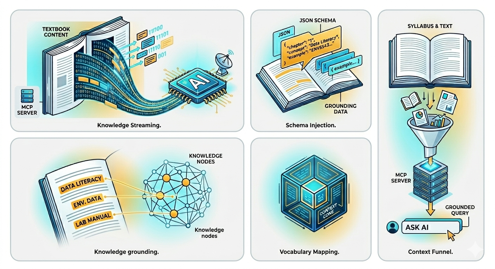

{.rounded fig-alt="Decorative image showing environmental data visualization."}

# Index {.unnumbered .hidden-title}

`Environmental Data Literacy` is a comprehensive guide designed to bridge the gap between ecological research and modern data science. By leveraging the power of the R ecosystem and the Tidyverse, this textbook empowers students and practitioners to move beyond basic spreadsheet analysis into a reproducible workflow encompassing data manipulation, spatial visualization, and advanced statistical modeling. From mastering the fundamentals of Markdown and data structures to executing complex multivariate ordinations and raster processing, this book provides the essential toolkit for turning raw environmental observations into actionable scientific insights.


## AI-Assisted Learning




The auhor has designed a custom AI chat assistant based on this content.  We will be using the [Positron IDE](https://positron.posit.co/) in class, though it may be integrated into most common chat-based interfaces. Ask your envsAI-TA a question, it can draw on the vocabulary, context, and examples you are encountering here, in the slides presented, and from the data we use in class, rather than giving generic answers and AI slop. Think of it as giving your AI tutor a copy of the syllabus, the textbook, and the lab manual, all at once.

Dr. Dyer will provide a connection information and setup instructions on the first day of class for [ENVS543: Environmental Data Literacy](https://bulletin.vcu.edu/search/?P=ENVS+543). 


## Open and Affordable Course Content

This textbook is being offered in support of [VCU Libraries' Open and Affordable Course Content Initiative](https://www.library.vcu.edu/research-teaching/open-and-affordable-course-content/).

::: {.button-container}

::: {.gold-box}
[Learn more about OER](https://www.library.vcu.edu/research-teaching/open-and-affordable-course-content/learn-more-about-oer/)
:::

::: {.gold-box}
[Resources for Students](https://www.library.vcu.edu/research-teaching/open-and-affordable-course-content/resources-for-students/)
:::

:::


A PDF version of this book can be [downloaded here](https://github.com/DyerlabTeaching/ENVS543-Book/releases/download/pdf_2025_12/Environmental-Data-Literacy.pdf), though all the interactive content has been removed.


## License

© 2025 by Rodney J. Dyer.  

All rights reserved. The author assumes no responsibility for the use or misuse of information contained in this text.  This book is licensed under a [Creative Commons Attribution-NonCommercial 4.0 International License](https://creativecommons.org/licenses/by-nc/4.0/).

You are free to:  

  - *Share* — copy and redistribute the material in any medium or format.  
  - *Adapt* — remix, transform, and build upon the material.  

Under the following terms:  

  - *Attribution* — You must give appropriate credit, provide a link to the license, and indicate if changes were made.  
  - *NonCommercial* — You may not use the material for commercial purposes.  


## How to Cite

This is an open source, online textbook and can be cited as:

> Dyer Rodney J. 2025.  Environmental Data Literacy. [https://environmentaldataliteracy.org](https://environmentaldataliteracy.org). 

Or use the following BibTeX entry.

```bibtex
@misc{dyer_2025,
  author = {Dyer, Rodney J},
  title = {Environmental Data Literacy},
  year = {2025},
  url = {https://environmentaldataliteracy.org}
}
```

## Logistics

If you would like to compile this book yourself, you will find the sourse code at its [GitHub repository](https://github.com/DyerlabTeaching/ENVS543-Book).  

The following code runs each time you render the project.  It will check to see if you have all the required libraries, and if not, it installs the needed ones and loads them into memory (so we do not get those stupid package startup messages).

```{r}
#| warning: false
source("package_loader.R")

libraries <- extract_libraries_from_markdown()
need_to_install <- check_missing_packages( libraries )
install_missing_packages( need_to_install )
for( pkg in libraries ) { 
  suppressPackageStartupMessages( 
    library( pkg, character.only = TRUE) 
  )
}
ggplot2::theme_set( theme_minimal( base_size=16) )
```


## Questions, Comments, or Concerns

If you have any questions, comments or concerns regarding this material, please contact [Dr. Rodney Dyer](mailto://rjdyer@vcu.edu).  Additional teaching and reserach materials can also be found at [rodneydyer.com](https://rodneydyer.com).


